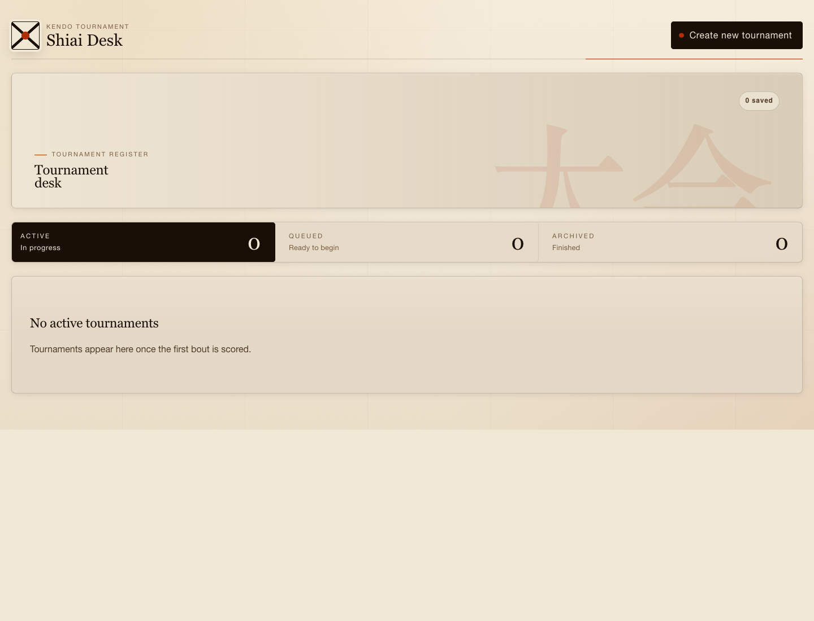
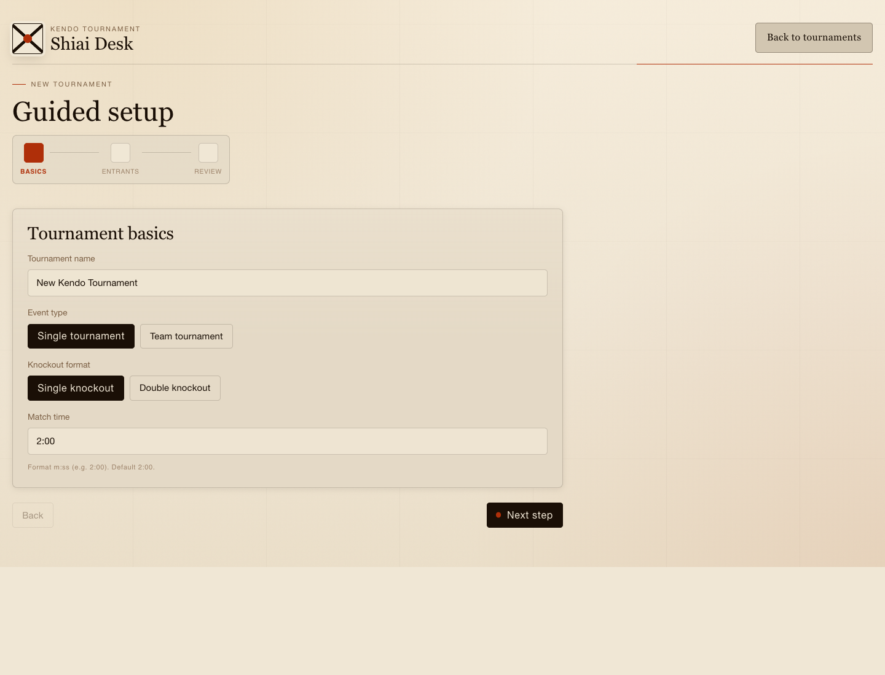
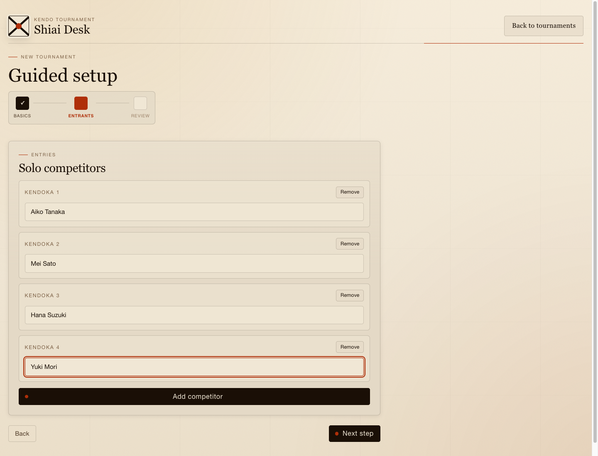
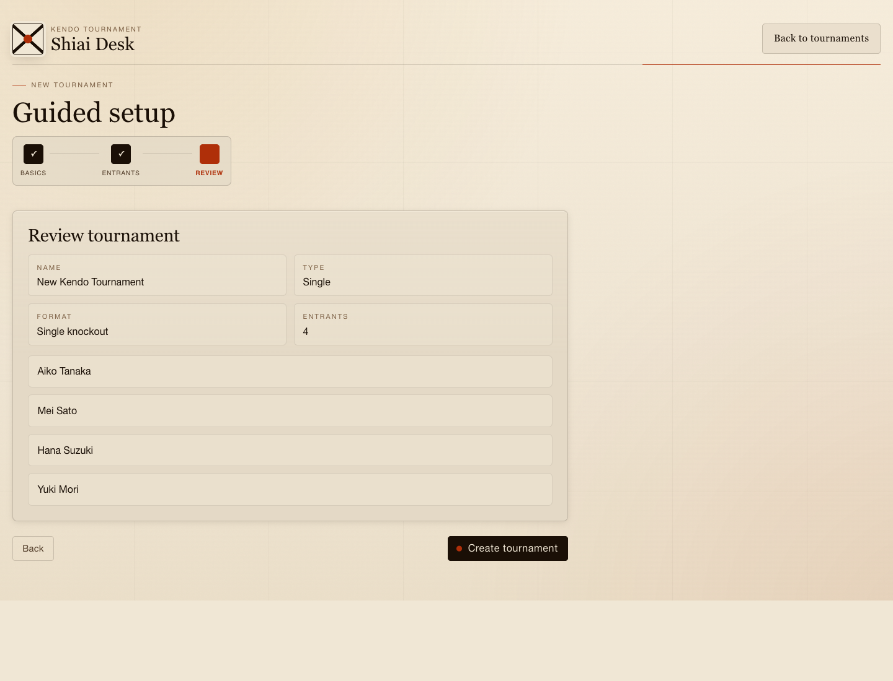
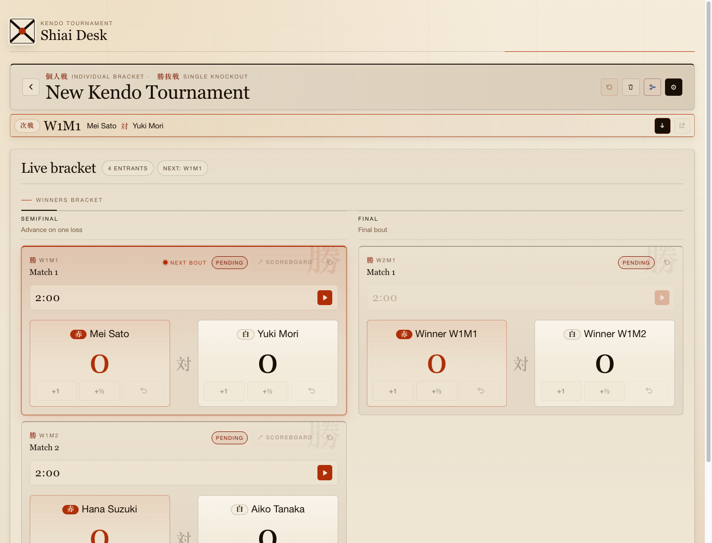
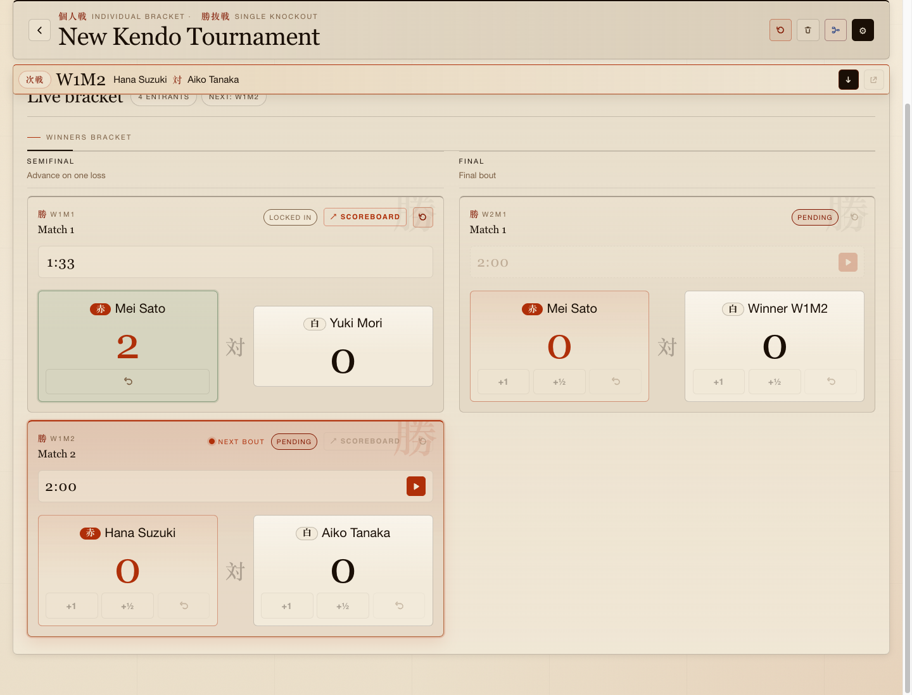
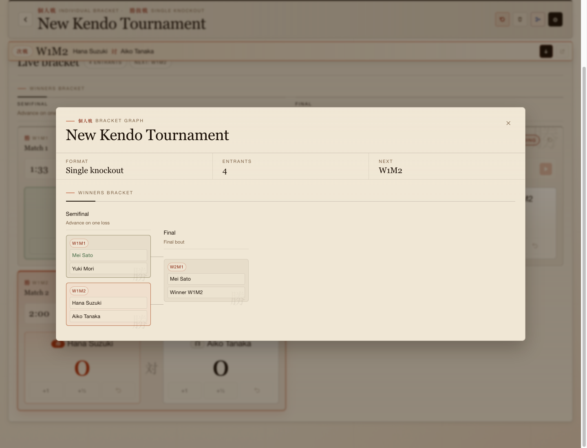
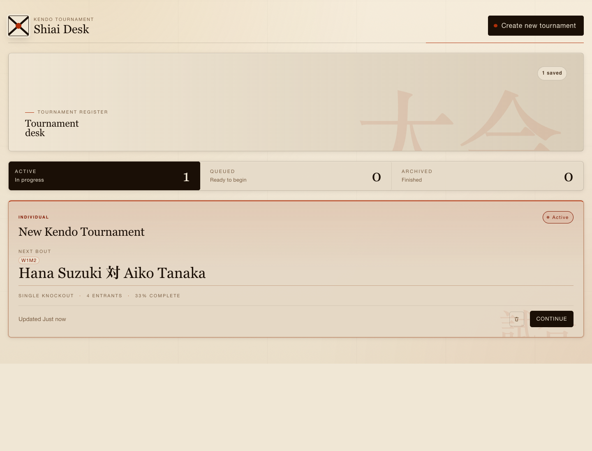

# Kendo Tournament Builder User Guide

This guide walks through the main website flow: creating a tournament, adding entrants, running the bracket, and returning to saved tournaments. The app stores tournaments in the browser's local storage, so each device and browser keeps its own tournament list.

## 1. Open The Tournament Desk

Open the website and start from the tournament desk. This page shows saved tournaments grouped by status:

- `Active`: tournaments with at least one result but no champion yet
- `Queued`: tournaments created but not started
- `Archived`: completed tournaments with a champion

Select `Create new tournament` to begin.

## 2. Enter Tournament Basics

On the `Basics` step:

1. Enter the tournament name.
2. Choose `Single tournament` for individual kendoka or `Team tournament` for team shiai.
3. Choose `Single knockout` or `Double knockout`.
4. Set the match time, using seconds or `m:ss` format.
5. Select `Next step`.

## 3. Add Entrants

For a single tournament, add each competitor name. Use `Add competitor` when you need more rows, or `Remove` to delete a row.

For a team tournament, add each team name and then fill in the members in roster order. The team order is used later for bout lineups.

## 4. Review And Create

Check the tournament summary before creating it. The review step shows the name, type, format, entrant count, and entrant list.

Select `Create tournament` when everything looks right.

## 5. Run The Live Bracket

The tournament page is the main workbench. It shows:

- The next bout strip at the top
- Bracket controls for reset, delete, graph view, and settings
- Match cards for each round
- Timers and scoring controls for each match

The next pending match is highlighted. Start a match timer before adding scores.

## 6. Score Matches

Use the match card controls during each bout:

1. Select the play button to start the timer.
2. Use `+1` or `+1/2` to award points.
3. Use the undo button to remove the last score event for that side.
4. When a competitor reaches the winning score, the match locks in and the winner advances.

The bracket updates immediately after a result is decided.

## 7. View The Bracket Graph

Use the bracket graph button in the top-right controls to open a compact bracket overview. The graph shows each match code, who has advanced, and which matches are still pending.

Select a match in the graph to jump back to that match card.

## 8. Return To Saved Tournaments

Use the back button to return to the tournament desk. Saved tournaments stay available in the same browser through local storage.

From the tournament desk, select a tournament card to reopen it, or use the delete control on a card to remove it.

## Website Deployment

The website is configured to deploy to GitHub Pages from `.github/workflows/deploy-pages.yml`.

Deployment behavior:

- Pushes to `main` build the Vite app with `npm run build`.
- The workflow uploads the generated `dist` folder to GitHub Pages.
- The configured Vite base path is `/kendo-tournament/`, matching the repository Pages URL.
- The expected public URL is `https://xianyangwong.github.io/kendo-tournament/`.

In GitHub, make sure the repository Pages source is set to `GitHub Actions` under `Settings > Pages`.
